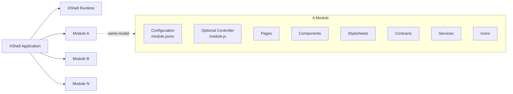

# XShell

**XShell is a browser-native runtime for building modular enterprise web applications that are meant to stay healthy, understandable, and maintainable for years.**

The idea is simple: use the Web Platform first, keep the runtime small, make behavior explicit, and make each module easy to understand on its own.

> **Understanding one module should not require understanding the whole application.**

XShell is not tied to a particular rendering library, build pipeline, or deployment model. Its stable concepts are Modules, resources, Contracts, Pages, Services, Areas, and browser-native URLs.

XShell is currently **pre-1.0** and evolving.

## What XShell is designed for

- **Long-lived enterprise UI**: applications should age well and require as little maintenance as possible.
- **Web Platform first**: ES modules, Web Components, Service Workers, URLs, CSS, `fetch`, and browser APIs are the foundation.
- **Low cognitive load**: years later, an engineer should still be able to open a module and quickly understand what it does.
- **Minimum magic**: important behavior should be visible in code or configuration.
- **Modularity**: applications are composed from independent Modules with stable identities and predictable structure.
- **Portable deployment**: application code uses the same URLs regardless of where resources are physically stored.
- **Developer friendly**: behavior should be easy to trace from source to browser, with minimal build-time machinery.
- **Understandable by humans and AI**: predictable files, naming, schemas, contracts, and boundaries make the system easy to inspect and reason about.
- **Explicit contracts**: public capabilities should be described wherever practical — properties, methods, events, slots, service APIs, and module-level capabilities.
- **Framework agnostic**: XShell is not built around React, Vue, Lit, or any other rendering framework. Its architecture is based on Web standards, and rendering technologies can evolve independently from the application structure.

## How an application fits together

An XShell application is the runtime plus one or more Modules.

A Module can contain Pages, Components, styles, Services, Contracts, icons, and optional module behavior.



A good Module should be easy to inspect and answer:

- What does it provide?
- What does it depend on?
- How is it configured?
- Which resources does it expose?
- Where should I look when something goes wrong?

Sample module file structure:
```
my-module/
├── module.jsonc
├── module.js
│
├── pages/
│   ├── index.js
│   ├── customers/
│   │   ├── index.js
│   │   └── detail.js
│   └── settings/
│       └── index.js
│
├── components/
│   ├── customer-card.js
│   ├── customer-form.js
│   └── status-badge.js
│
├── contracts/
│   ├── customer-repository.json
│   └── notification-service.json
│
├── services/
│   ├── customer-repository.js
│   └── notification-service.js
│
├── styles/
│   ├── index.css
│   └── customers.css
│
└── icons/
    ├── customer.svg
    ├── settings.svg
    └── warning.svg
```


### Packaging and current deployment

The V0 browser runtime maps expanded module directories through its Service Worker to normal URLs such as `/_assets/my-module/...`.
JavaScript, CSS, Pages, and icons are served from those expanded resources.

The `pack` command publishes immutable expanded or ZIP packages under `<output>/<id>/<version>.<hash>/` for normal modules and the XShell framework.
Module ZIPs contain `module.json` and `module.zip`, with `modules.<id>.assetsUrl = "url:./module.zip"` and `modules.<id>.files = [...]` in the descriptor.
XShell ZIPs contain `xshell.json` and `xshell.zip`, with `xshell.assetsUrl = "url:./xshell.zip"` and `xshell.files = [...]` in the descriptor.
Both `files` arrays use the generated physical inventory. An existing package path is reused for the same representation and cannot be replaced
by the other representation. ZIP packaging is implemented, but runtime ZIP-backed browser loading is not; deploy expanded resources for the current
Service Worker.

Module and XShell descriptors may be authored as JSON or JSONC during development. Packaging parses either form and publishes normalized strict JSON
using the canonical filenames `module.json` and `xshell.json`. Production packages therefore do not contain `module.jsonc` or `xshell.jsonc`.


## A few important boundaries

XShell keeps responsibilities intentionally separate:

```text
Resolver        -> decides what a resource means and where it is
Loader          -> obtains or constructs that resource

Contract        -> describes public API
Implementation  -> provides behavior

Property        -> public API
State           -> private reactive data

State engine    -> owns state behavior
Render engine   -> owns rendering

Module          -> reusable package
Area            -> navigation/composition context

Page            -> presentation + lifecycle
Navigation      -> browser URLs and page stacks
```

These boundaries make the runtime easier to understand, change, and debug.

## Components and Pages

XShell uses **Web Components** as its component foundation.

Components may be native custom-element classes or definition objects with a public `contract` and a separate implementation.

Pages share many concepts with Components, but add navigation context and Page lifecycle.

```text
Page = Component model + Navigation context
```

## Modules, Areas, and Navigation

A **Module** owns reusable resources and configuration.

An **Area** composes one or more Modules into a navigation context.

Navigation handles:

- friendly paths and routes
- browser history
- path or hash navigation
- page stacks
- dialogs and embedded Pages
- browser URL generation

Path navigation is preferred when the server provides SPA fallback. Hash navigation remains available when it does not.


## Designed to be debugged

Long-lived software must be easy to diagnose.

XShell favors:

- predictable resource URLs
- stable Module identities
- explicit configuration
- deterministic resource inventories
- clear Resolver / Loader separation
- explicit lifecycle boundaries
- dedicated diagnostics

When something fails, an engineer should be able to follow the path from configuration to resource resolution to loading to runtime behavior.

## Browser first, server where useful

The browser owns the application runtime.

ASP.NET Core currently provides:

- bootstrap generation
- development resource serving
- on-demand compilation
- SPA fallback
- temporary-file handling
- packaging/build tooling

Browser behavior stays in the browser; server and build concerns stay on the server.


## Getting started

XShell currently targets **.NET 10**.

Run the demo:

```bash
dotnet run --project src/DProjects.XShell -- server
```

## Documentation

The documentation is itself an XShell Module:

```text
Resources/DProjects.XShell/xshell-docs/
```

Start here:

```text
Resources/DProjects.XShell/xshell-docs/pages/index.md
```

It covers architecture, Components, Pages, subsystems, extensions, specifications, and ADRs.

## Engineering direction

When evolving XShell, prefer:

1. Web Platform capabilities first;
2. explicit behavior;
3. clear ownership;
4. a small core;
5. convention for predictable structure;
6. configuration for real choices;
7. abstraction only when concrete use cases justify it.

A good XShell Module should still be readable years after it was written.

---

> **Build on the browser. Keep the architecture explicit. Make the system easy to understand, debug, and maintain for years.**
