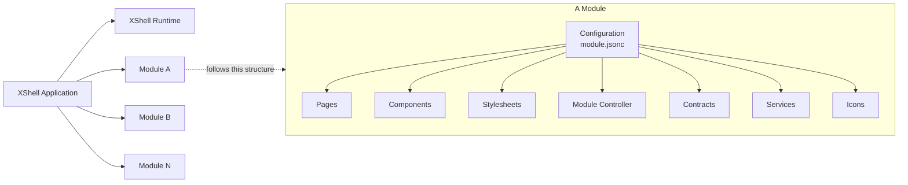
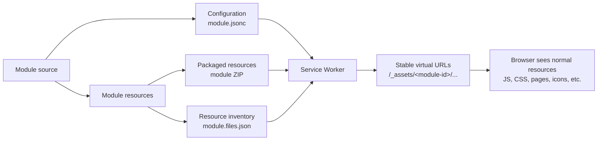

# XShell

**XShell is a browser-native application runtime for building modular web applications with as little framework magic as possible.**

It is an experiment in a deliberately conservative direction: use the Web Platform as the foundation, keep the runtime small and explicit, make modules independently understandable, and avoid turning application architecture into a build-tool artifact.

XShell is currently pre-1.0 and evolving. The codebase is intended to remain understandable at the source level while the architecture stabilizes.

## Why XShell

Modern web development is extremely capable, but it can also accumulate layers of indirection: bundlers, framework-specific component models, generated dependency graphs, proprietary routing conventions, hidden lifecycle rules, and large dependency trees.

XShell starts from a different question:

> How much application architecture can be built directly on browser standards while keeping the important boundaries explicit?

The project favors **clarity over cleverness**. Most concepts have a concrete representation in configuration, source files, browser APIs, or runtime objects. The goal is not to eliminate abstraction; it is to make abstraction visible and proportionate to the problem it solves.

## Design objectives

### Simple by default

A small application should not require a large application framework.

XShell tries to keep the core compact, move optional capabilities into modules, and avoid infrastructure that exists only to support other infrastructure.

### Built on the Web Platform

The browser is the runtime.

XShell builds around native platform capabilities such as:

- ES modules
- Web Components
- Service Workers
- the History API
- standard URLs
- DOM events
- CSS
- `fetch`
- browser storage and messaging primitives

Framework abstractions should complement these APIs, not hide them unnecessarily.

### Minimum magic

Important behavior should be discoverable from the code and configuration.

XShell intentionally keeps boundaries such as these explicit:

```text
Resolver        -> decides what a resource means and where it is
Loader          -> obtains or constructs that resource

Contract        -> describes public API
Implementation  -> provides behavior

Property        -> public component/page API
State           -> private reactive implementation data

State engine    -> owns state behavior
Render engine   -> owns rendering

Module          -> reusable package
Area            -> application/navigation composition context

Page            -> presentation + lifecycle
Navigation      -> browser URL and page-stack behavior
```

These distinctions are architectural constraints, not naming conventions.

### Modular applications

An XShell application is composed from modules.

Each module has a stable identity, its own resources and configuration, and can contribute capabilities such as components, pages, services, menus, routes, styles, contracts, and controllers.

The application itself is the root module.

Module discovery is explicit through `module.jsonc` references, and the runtime maintains one canonical module definition and one live module instance per module id.

### Stable virtual resources

Module files are exposed to the browser through a uniform virtual namespace:

```text
/_assets/<module-id>/...
```

A Service Worker maps that stable namespace to the physical location of each package.

This separates the URL used by application code from the place where a package is actually stored or served.

For example:

```text
/_assets/x/components/x-button.js
/_assets/xshell-docs/pages/10-architecture/index.md
```

Application code can therefore reason about module resources without knowing their deployment location.

### Packaging without changing the programming model

Modules are authored as normal directories.

XShell tooling can compile and package them as expanded packages or immutable ZIP artifacts, while `module.files.json` provides the canonical resource inventory for a package.

The long-term deployment model is intentionally compatible with **immutable packages + Service Worker virtualization**, so deployment format does not need to leak into application code.

> Current status: XShell can produce ZIP packages, but the browser runtime does not yet load module resources directly from ZIP files. Runtime ZIP-backed loading is a future capability, not an implemented feature.

### Future-proof by reducing framework ownership

XShell tries to own as little syntax and runtime behavior as practical.

The closer an application remains to browser standards, plain JavaScript, URLs, HTML, CSS, and explicit data structures, the less application code depends on the lifetime of a particular frontend ecosystem.

“Future-proof” does not mean APIs never change. It means architectural value should survive implementation changes.

### CSP-friendly

The runtime is designed to work with a restrictive Content Security Policy and avoids depending on `unsafe-inline` or `eval`-style execution as an architectural requirement.

### Understandable by humans and LLMs

LLM-assisted engineering is becoming part of normal software development. XShell treats **machine understandability as an architectural quality**, not as a documentation afterthought.

The project therefore favors:

- explicit files over generated hidden state
- stable naming conventions
- small, local abstractions
- declarative configuration
- clear ownership boundaries
- conventional module layouts
- source documentation close to the implementation
- schemas for public configuration and contracts
- predictable resource URLs
- deterministic package inventories

The objective is that a developer — or an engineering agent — can inspect a focused part of the repository and understand its role without first reconstructing an entire framework-specific mental model.

## Architecture at a glance

A simplified startup flow is:

```text
host HTML
    ↓
bootstrap
    ↓
root module.jsonc
    ↓
recursive module discovery
    ↓
effective configuration
    ↓
Service Worker resource mappings
    ↓
module.files.json inventories
    ↓
Resolver + Loader configuration
    ↓
XShell runtime initialization
    ↓
services + modules
    ↓
Areas
    ↓
Navigation
    ↓
Pages
```

The normal resource flow is:

```text
logical resource
    ↓
Resolver
    ↓
URL + loader
    ↓
Loader
    ↓
resource
```

This separation is central to XShell. Resolution decides **what/where**; loading decides **how**.

## Components and Pages

XShell uses Web Components as its component foundation.

A component may be a native custom-element class or a definition object with a public `contract` and a separate implementation.

Definition-based components can use pluggable state and render engines while keeping the public API independent from those engines.

Pages reuse the same general model but add navigation context and Page lifecycle:

```text
Page = Component model + Navigation context
```

Pages and Components remain separate runtime concepts even where they share conventions.

## Areas and Navigation

Modules contribute reusable navigation information. **Areas** compose participating modules into an application navigation context.

Navigation owns browser-facing concerns such as:

- path and hash navigation
- History API integration
- friendly routes
- page stacks
- dialogs and embedded pages
- browser URL generation

Path navigation is the preferred mode when the host provides SPA fallback. Hash navigation remains available when server cooperation is not possible.

## Browser runtime, server support

The browser owns the application runtime.

ASP.NET Core currently provides the host-side integration used by this repository:

- generated bootstrap files
- development resource serving
- on-demand development compilation
- SPA fallback for path navigation
- temporary-file middleware
- package/build tooling

The architectural intention is to keep browser framework behavior in the browser and server/build concerns on the server.

## Project structure

```text
src/DProjects.XShell/
├── Commands/                    # Development and packaging commands
├── Middlewares/                 # ASP.NET Core hosting/resource middleware
├── Services/                    # Build-time/server-side services
└── Resources/DProjects.XShell/
    ├── xshell/                  # Browser runtime
    ├── x/                       # Standard UI module
    ├── x-demo/                  # Demo/reference application module
    ├── xshell-docs/             # XShell documentation module
    ├── xshell-diagnostics/      # Runtime diagnostics module
    └── codemirror/              # CodeMirror integration module
```

The modules under `Resources/DProjects.XShell/` are real runtime resources, not merely samples or static content.

## Getting started

XShell currently targets **.NET 10** for its host and tooling.

Run the bundled development server from the repository root:

```bash
dotnet run --project src/DProjects.XShell -- server
```

The server command uses `x-demo` by default. A different root module can be selected with `--app-config`.

For example:

```bash
dotnet run --project src/DProjects.XShell -- server \
  --app-config /_resources/DProjects.XShell/x-demo/module.jsonc
```

XShell can also be hosted from an ASP.NET Core application:

```csharp
using DProjects.XShell;

var builder = WebApplication.CreateBuilder(args);

builder.Services.AddXShell();

var app = builder.Build();

app.UseXShell(new Extensions.Configuration {
    AppConfigPath = "/_resources/DProjects.XShell/x-demo/module.jsonc"
});

app.Run();
```

## Packaging

The `pack` command creates a distributable package from a module or from the XShell framework:

```bash
dotnet run --project src/DProjects.XShell -- pack \
  --source ./path/to/module \
  --output ./dist
```

Add `--zip` to produce an immutable ZIP artifact:

```bash
dotnet run --project src/DProjects.XShell -- pack \
  --source ./path/to/module \
  --output ./dist \
  --zip
```

Packaging compiles supported authored resources where required and generates the final `module.files.json` inventory from the distributable package contents.

## Documentation

The canonical project documentation is itself an XShell module:

```text
Resources/DProjects.XShell/xshell-docs/
```

Its pages cover:

- architecture
- components
- subsystems
- extensions
- configuration specifications
- architecture decision records

Start with:

```text
Resources/DProjects.XShell/xshell-docs/pages/index.md
```

The documentation is intentionally kept close to the runtime it describes and can also be consumed through XShell itself.

## Engineering principles

When evolving XShell, the preferred order is:

1. use an existing Web Platform capability;
2. make the behavior explicit;
3. preserve architectural boundaries;
4. keep the core small;
5. add convention where it removes repetition;
6. add configuration where a real choice exists;
7. add abstraction only when multiple concrete uses justify it.

Two useful rules are:

> **Convention describes structure. Configuration expresses intent.**

and:

> **Inventory tells XShell what exists. Configuration tells XShell what to do when there is a choice.**

## What XShell is not

XShell is not intended to be:

- a replacement language for the Web Platform
- a framework-specific virtual browser
- a mandatory bundler pipeline
- a dependency-injection framework disguised as a UI library
- a system where every concern is configurable
- an abstraction layer over standards simply for the sake of abstraction

The project is deliberately opinionated about architecture while trying to remain conservative about technology.

## Status

XShell is currently **pre-1.0** and under active architectural development.

Some capabilities are intentionally ahead of others. In particular, package creation already supports immutable ZIP artifacts, while direct browser loading from ZIP-backed module packages is still future work.

The project should be evaluated as an evolving architecture and runtime rather than as a finished general-purpose frontend framework.

---

XShell's central idea is simple:

> **Build on the browser, make the architecture explicit, and keep enough of the system visible that it remains understandable years later — by both engineers and the tools that help them.**

## Arquitecture

### 1. Application composition


An XShell application is composed from the XShell runtime plus one or more modules.
Each module is a self-contained package that can contribute pages, components, styles, services, contracts, icons, and optional module behavior.

## Module packaging and resource delivery



A module can be packaged independently from where its resources are ultimately served.
The Service Worker exposes the package through stable /_assets/<module-id>/... URLs, so application code sees normal web resources regardless of the physical deployment format.