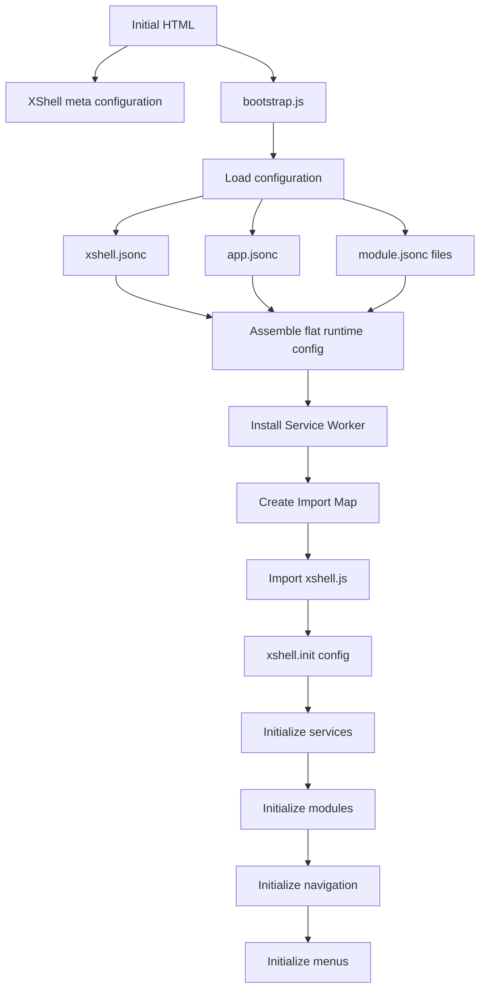

# Bootstrap

XShell bootstrap initializes the runtime from the host page to the first application navigation.

## Status

Draft.

## Initial HTML

The initial HTML page contains the XShell startup configuration as meta elements and includes the bootstrap script.

A typical host page looks like:

```html
<!DOCTYPE html>
<html lang="en">
<head>
    <meta charset="utf-8">
    <meta name="viewport" content="width=device-width, initial-scale=1.0">

    <!-- XShell configuration -->
    <meta name="xshell.app_base_url" content="">
    <meta
        name="xshell.app_config_url"
        content="/_resources/DProjects.XShell/samples/sample1/app.jsonc">
    <meta name="xshell.sw_url" content="/sw.js">

    <!-- XShell bootstrap -->
    <script src="/_resources/DProjects.XShell/xshell/bootstrap.js"></script>
</head>
<body>
</body>
</html>
```

XShell static resources are exposed by the ASP.NET host under URLs such as:

- /_resources/DProjects.XShell/...

For example:

- /_resources/DProjects.XShell/xshell/bootstrap.js
- /_resources/DProjects.XShell/xshell/xshell.jsonc
- /_resources/DProjects.XShell/modules/x/module.jsonc

The important startup inputs are:

The important inputs are:

```text
xshell.app_base_url
xshell.app_config_url
xshell.sw_url
```

and the inclusion of:

```text
xshell/bootstrap.js
```

## Bootstrap flow

`bootstrap.js` performs these main steps:



## Load configuration

Bootstrap loads configuration from:

1. `xshell.jsonc`;
2. the application `app.jsonc`;
3. each configured module's `module.jsonc`.

These sources are normalized and merged into one flat runtime configuration.

See [Configuration](configuration.md).

## Service Worker

Bootstrap installs the application Service Worker before XShell starts.

The Service Worker intercepts and caches requests under the configured asset namespace, for example:

```text
/_assets
```

It maps those runtime asset URLs to the actual framework and module resource locations.

See [Service Worker](service-worker.md).

## Import map

Bootstrap creates the browser import map from configured `resolver.import:*` entries.

## XShell initialization

Bootstrap then imports `xshell.js` and calls:

```js
await xshell.init(config);
```

Initialization performs the main runtime setup:

```text
init services
    ↓
init modules
    ↓
init navigation
    ↓
init menus
```

The completed configuration is read-only when passed to the runtime.

## Related documentation

* [Configuration](configuration.md)
* [Modules](modules.md)
* [Navigation](navigation.md)
* [Service Worker](service-worker.md)
