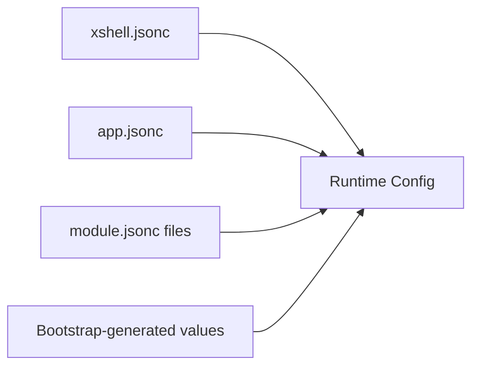

# Configuration Architecture

XShell runtime configuration is a single flat key/value map assembled during bootstrap.

## Status

Draft.

## Configuration model

Keys use naming conventions to group related settings:

```text
app.*
xshell.*
navigation.*
page.*
component.*
modules.<name>.*
resolver.*
```

For example:

```json
{
    "navigation.mode": "hash",
    "page.renderEngine": "plain",
    "component.stateEngine": "plain",
    "app.name": "sample-app",
    "modules.x.page.renderEngine": "x"
}
```

The configuration namespace is flat. Dots are part of the key and express logical grouping; they do not represent nested objects.

Values may still be any JSON-compatible value, including arrays and objects.

## Sources

Bootstrap assembles the final configuration from:

1. framework configuration from `xshell.jsonc`;
2. application configuration from `app.jsonc`;
3. each configured `module.jsonc`;
4. values generated during bootstrap, such as module resolvers and runtime paths.



Later values replace earlier values with the same key.

## Module configuration

Module-local fields are stored under:

```text
modules.<name>.*
```

For example:

```text
page.renderEngine
→ modules.x.page.renderEngine

styles
→ modules.x.styles
```

Fields beginning with `global.` are promoted into the shared configuration by removing that prefix:

```text
global.xshell.areas.main.home
→ xshell.areas.main.home
```

## Resolvers

Resolver entries use keys of the form:

```text
resolver.<kind>:<name-or-pattern>
```

Examples:

```text
resolver.import:xshell
resolver.component:x-{name}
resolver.page:/_assets/x/{path}.html
```

Bootstrap also generates conventional resolver entries for module icons, layouts, components, pages, and JavaScript modules.

See [Resolvers](resolvers.md).

## URL normalization

URLs are normalized before values are merged.

The normalization base depends on the source:

* framework values use the XShell asset path;
* application values are resolved relative to `app.jsonc`;
* module values are resolved relative to that module's asset path.

Leading-slash module values therefore become module-relative runtime asset paths.

## Final configuration

After bootstrap, the resulting configuration may look like:

```json
{
    "navigation.mode": "hash",
    "page.renderEngine": "plain",
    "page.stateEngine": "plain",
    "component.renderEngine": "plain",
    "component.stateEngine": "plain",

    "xshell.assetsPrefix": "_assets",
    "xshell.areaDefault": "main",

    "app.name": "sample-app",
    "app.label": "Sample app",
    "app.base": "http://localhost:5000",

    "modules.x.src": "http://localhost:5000/modules/x/module.jsonc",
    "modules.x.name": "x",
    "modules.x.page.renderEngine": "x",
    "modules.x.component.renderEngine": "x",

    "xshell.areas.main.home": "/_assets/module1/pages/page0.html",

    "resolver.import:xshell": "/_assets/xshell/xshell.js",
    "resolver.component:x-{name}": "/_assets/x/components/x-{name}.js; loader=component-js; cache=true; module=x;",
    "resolver.page:/_assets/x/{path}.html": "/_assets/x/{path}.html; loader=page-html; cache=true; module=x;"
}
```

This is the assembled runtime configuration, not the contents of any single JSONC file.

Once created, the runtime configuration is **read-only**. `Config` freezes the assembled top-level map before exposing it to the rest of XShell.

Runtime services and modules consume configuration values; they do not modify the configuration after bootstrap.

## Runtime availability

The complete configuration is assembled before the import map is created and before `xshell` is initialized.

The runtime exposes the resulting read-only map through the `Config` service.

## Related documentation

* [Bootstrap](bootstrap.md)
* [Modules](modules.md)
* [Resolvers](resolvers.md)
* [Application Specification](../specifications/application.md)
* [Module Specification](../specifications/module.md)
