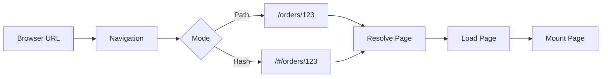

# Navigation

XShell supports two navigation modes:

```text
path
hash
```

Both modes use the same Page and navigation infrastructure.

## Path navigation

Path navigation uses normal browser URLs.

For example:

```text
/orders/123
/settings/profile
```

This mode requires server collaboration.

When the browser requests one of these URLs directly, the server must return the XShell host application so that client-side navigation can continue from that path.

Conceptually:

```text
/orders/123
    ↓
server
    ↓
XShell host page
    ↓
Navigation
    ↓
Page
```

Path navigation produces clean application URLs and integrates with the browser history.

## Hash navigation

Hash navigation stores the navigation path after `#`.

For example:

```text
/#/orders/123
/#/settings/profile
```

Everything before the hash identifies the host page, while XShell handles everything after it.

This mode does not require special server routing and is therefore always available.

Conceptually:

```text
/#/orders/123
    ↓
XShell Navigation
    ↓
Page
```

Hash navigation is mainly provided for compatibility and environments where server-side routing cannot be configured.

## Navigation mode

The navigation mode is selected through configuration.

For example:

```text
navigation.mode = path
```

or:

```text
navigation.mode = hash
```

The rest of the application does not need to depend on the selected mode.

Navigation converts the browser URL into the corresponding Page resource and loads it through the standard XShell Resolver and Loader infrastructure.



## Summary

The two navigation modes are:

```text
Path
    clean URLs
    requires server collaboration

Hash
    URLs after #
    no server routing required
    always available
```

Both ultimately resolve, load, and display the same XShell Pages.

## Related documentation

* [Pages](pages.md)
* [Resolvers](resolvers.md)
* [Loaders](loaders.md)
* [Configuration](configuration.md)
