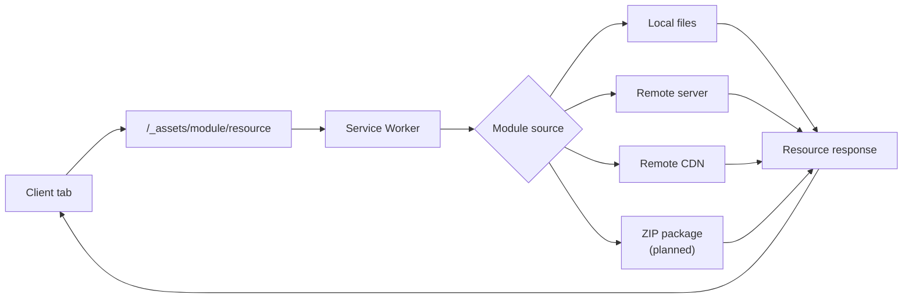

# Service Worker

XShell always installs a Service Worker as part of bootstrap.

Its main responsibility is to provide a uniform way for the browser tab to access module resources, independently of where those resources are actually stored.

## Resource namespace

Module resources are exposed through a stable URL prefix such as:

```text
/_assets
```

For example:

```text
/_assets/x/components/x-button.js
/_assets/x/pages/home.js
/_assets/x/icons/menu.svg
```

From the client application's point of view, module resources are always accessed through this namespace.

## Why the Service Worker exists

Modules may come from different physical locations.

For example, a module may be served:

```text
local application
remote server
remote CDN
```

and in the future:

```text
ZIP package
```

The browser should not need to know how each module is physically distributed.

Conceptually:

```text
Client tab
    ↓
/_assets/<module>/<resource>
    ↓
Service Worker
    ↓
actual module location
```

The Service Worker provides the translation between the uniform XShell resource URL and the actual resource source.

## Remote modules

A module can be hosted independently on another server.

For example, the application may request:

```text
/_assets/module1/components/button.js
```

while the real resource is located at:

```text
https://modules.example.com/module1/components/button.js
```

The Service Worker intercepts the `/_assets/...` request and resolves it to the appropriate remote module resource.

This keeps resource URLs inside the application consistent even when modules come from different servers.

## Packaged modules

A future module distribution model is to load modules from ZIP packages.

Conceptually:

```text
/_assets/module1/pages/home.js
    ↓
Service Worker
    ↓
module1.zip
    ↓
pages/home.js
```

ZIP-backed modules are not implemented yet.

The important architectural idea is that the client-facing URL does not change.

Whether the module comes from individual remote files or a package is hidden behind the Service Worker.

## Flow



## Summary

The Service Worker acts as a resource virtualization layer for modules.

It gives the application one consistent way to access module resources:

```text
/_assets/<module>/...
```

while hiding where and how those resources are actually stored.

## Related documentation

* [Bootstrap](bootstrap.md)
* [Modules](modules.md)
* [Resolvers](resolvers.md)
