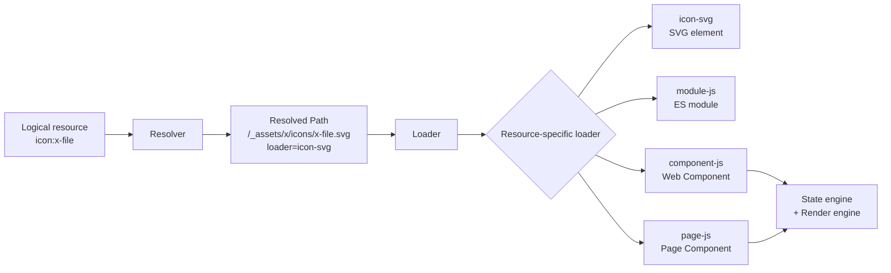

# Loaders

Loaders are responsible for loading resources after they have been resolved.

The Resolver decides **where** a resource is and **which loader** should handle it.

The Loader coordinates the actual load.

## Responsibilities

The Loader is responsible for:

* asking the Resolver to resolve a logical resource;
* selecting the resource-specific loader;
* invoking that loader with the resolved resource location and context;
* returning the loaded runtime result.

The resource-specific loader is responsible for understanding the resource format.

For example:

```text
icon-svg
    → fetch SVG and return an SVG element

module-js
    → import an ES module

component-js
    → load or build a Web Component class

page-js
    → load or build a Page component
```

## Timing

Each Loader registry item's `time`, and the matching `xshell:loader:resource:loaded` or `xshell:loader:resource:error` Bus event's `time`, is the
duration in milliseconds of that individual concrete resource loader operation. It is measured from immediately before `loader.load(url, context)`
until that operation resolves or rejects. Resolution, cache lookup, loader selection, and loader implementation import are outside this duration.
Cached requests do not start another concrete load or create another timed registry item.

## Cache identity

A resolver rule can opt into Loader caching and choose how the logical resource reference contributes to cache identity:

```js
{ cache: true, cacheMode: "full" }
{ cache: true, cacheMode: "path" }
```

`full` is the default when `cacheMode` is omitted. It uses the full logical resource reference, including its query, so `object:/data.json?page=1`
and `object:/data.json?page=2` remain separate cache entries. `path` excludes only the query from cache identity, so query variants share the same
cached value and any in-flight load promise. The logical resource scheme is preserved, and fragments remain part of identity.

`cacheMode` affects only the Loader's internal cache key. It does not rewrite the requested resource, resolved resource location, registry diagnostics, or values
such as a Page instance's `src`. Use `path` only for resource types whose implementation identity is genuinely independent of query state.

## Flow

```text
logical resource
    ↓
Resolver
    ↓
resource location + loader metadata
    ↓
Loader
    ↓
resource-specific loader
    ↓
runtime result
```

## Examples

Loading an icon:

```text
icon:x-file
    ↓
/_assets/x/icons/x-file.svg
loader=icon-svg
    ↓
SVG element
```

Loading an ES module:

```text
module:/_assets/module1/module.js
    ↓
/_assets/module1/module.js
loader=module-js
    ↓
ES module export
```

Loading a component:

```text
component:x-button
    ↓
/_assets/x/components/x-button.js
loader=component-js
    ↓
Web Component class
```

Loading a page:

```text
page:/_assets/module1/pages/page1.js
    ↓
/_assets/module1/pages/page1.js
loader=page-js
    ↓
Page component
```

Generated Page resolver rules use `cacheMode: "path"`: the Page implementation is identified by its path, while each Page instance retains the full
navigation `src` and query.

Markdown Page rules preserve the `.md` URL and select `page-md` with the same Page-class cache semantics. `page-md` loads the Component selected by
`xshell.ui.component.markdown` through Resolver → Loader and returns a normal Page class. Mount creates that Component with the resolved normal URL in
`src`; the Component fetches the document and owns Markdown conversion. The adapter never fetches or parses Markdown itself. An unavailable
configured Component fails through the normal Loader error path. See [Markdown Pages](70-pages.md#markdown-pages).

## Loader vs resource-specific loader

It is useful to distinguish the two responsibilities:

```text
Loader
    coordinates loading

resource-specific loader
    knows how to load a particular resource type
```

The generic Loader does not need to know how SVG, JavaScript, Components, or Pages are implemented.

It only dispatches the resolved resource to the appropriate loader.

## Declarative component and Page dependencies

A definition-based Component or Page can declare `dependencies` as an object of ordinary XShell resource references. The Loader accepts that
object, resolves and loads each value through its normal path, and returns an object with the same keys and the loaded values. The corresponding
loader exposes that result to the controller as `controller({ dependencies })`.

```text
dependencies: { fileIcon: "icon:x-file" }
    ↓
Resolver → resource location + loader metadata
    ↓
Loader → loaded icon
    ↓
controller({ dependencies }) → dependencies.fileIcon
```

This feature does not add a dependency container or a second loading model. It declares resources known when a Component or Page definition is
loaded. Controller code can still use its `loader` service and `loader.load(...)` for dynamic/runtime resource loading.

If a resource in a declared dependency object cannot be resolved, the Loader rejects the request. If resolution succeeds but one or more loads
fail, the Loader waits for its requested loads to settle and then rejects. The enclosing Component or Page loader cannot finish creating its class
or controller in either case.

## Engines

Some resource-specific loaders use additional engines.

For example, Components and Pages can use:

```text
state engine
render engine
```

Conceptually:

```text
definition-based component or Page loader
 ├─ contract / properties / public API
 ├─ controller / lifecycle
 ├─ state engine → reactive state
 └─ render engine → rendered output
```

The loader is the orchestrator. The state engine creates, observes, and notifies reactive state and requests invalidation. The render engine creates,
mounts, updates, and unmounts rendered output. Neither engine owns contracts, public APIs, controllers, lifecycle, services, property or attribute
semantics, or navigation. Not every loader needs an engine.

When a render engine emits template commands through a handler callback, that callback is a loader-provided bridge. The loader decides how the command
is handled; the callback does not transfer controller or lifecycle ownership to the render engine.

## Diagram



## Related documentation

* [Resolvers](80-resolvers.md)
* [Components](60-components.md)
* [Pages](70-pages.md)
* [Configuration](20-configuration.md)
